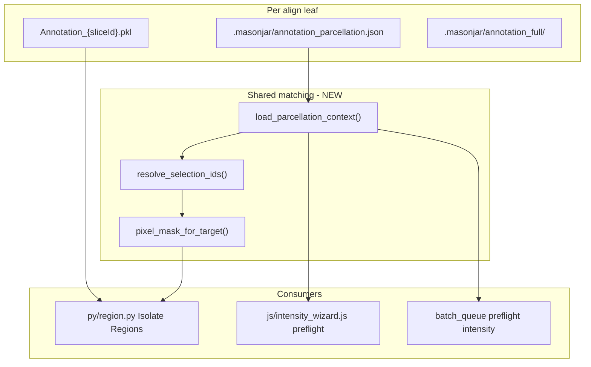

# Build plan — Isolate Regions aggregation + wizard processing feedback

**Status:** Draft for implementation  
**Created:** 2026-05-29  
**Context:** Parcellation rollup (v2.4.6+) writes coarse atlas IDs into `Annotation_*.pkl`. Isolate Regions still aggregates ROI pixels using full-detail descendant matching (`children_for_target` + exact label equality). That mismatch produces empty PKLs after parcellation. Separately, new bulk surfaces (parcellation wizard, batch parcellation step, Adjust bulk) lack the control-lock and immediate feedback patterns established in the CZI wizard.

**Authoritative architecture:** [`AGENTS.md`](../AGENTS.md)  
**Related prior work:** parcellation extensions (`py/apply_parcellation.py`, `pages/parcellation_wizard.html`)

---

## Goals

1. **Correct ROI extraction** after any parcellation tier (full detail, semantic tiers, raw `st_level`, excluded regions).
2. **One hierarchy matching contract** shared by parcellation relabel and intensity aggregation (no duplicated rollup logic).
3. **Immediate user feedback** on every action that starts processing — disable controls, show status/progress, log a line within ~200 ms.
4. **No regression** for users who never run parcellation (full-detail annotations behave exactly as today).

---

## Non-goals

- Changing parcellation rollup semantics or backup/metadata format.
- Auto re-running Isolate Regions after parcellation (document manual re-run instead).
- Align Finish parcellation UI changes (already shipped).
- Rewriting Count/Dual/Collate aggregation (audit only; count uses pixel IDs directly and remains valid after rollup).

---

## Architecture overview



### Matching contract

| Annotation state | Selected target `T` | Pixel label `L` counts toward `T` when… |
|------------------|---------------------|----------------------------------------|
| Full detail (no parcellation entry) | any valid id | `L == T` **or** `T` is ancestor of `L` (`id_path_contains(structure_map, L, T)`) — **current behavior** |
| Parcellated at tier `X` / level `N` | user picks fine or coarse id | `L == ancestor_at_level(T, tier=X, st_level=N)` — selections are **rolled to annotation resolution** before matching |
| Excluded regions applied | — | Zero pixels (already background); no special intensity rule |

**`include_layers` rule:** Allowed only when annotation labels are at layer resolution (full detail **or** parcellation tier `layers`). Otherwise force off and warn in UI/preflight.

---

## Phase 1 — Shared Python matching core

**Prerequisite for all aggregation fixes. Do not ship UI-only work without this phase.**

### Step 1.1 — Add `py/annotation_match.py`

| Item | Detail |
|------|--------|
| **New file** | [`py/annotation_match.py`](../py/annotation_match.py) |
| **Imports** | `structure_catalog.ancestor_at_level`, `region_config.id_path_contains`, `annotation_relabel.load_parcellation_meta` |

**Types / functions to implement:**

```python
@dataclass
class ParcellationContext:
    tier_id: str | None          # None when using st_level only
    st_level: int | None
    is_full_detail: bool
    excluded_region_ids: list[int]

def load_parcellation_context(annotation_dir: Path, slice_id: str | None = None) -> ParcellationContext:
    """Read annotation_parcellation.json. slice_id=None → run-wide mode (must be consistent across slices)."""

def normalize_contexts_per_slice(annotation_dir: Path, slice_ids: list[str]) -> dict[str, ParcellationContext]:
    """Per-slice contexts; caller warns if tiers differ."""

def resolve_output_targets(
    structure_map: dict,
    selected_region_ids: list[int],
    include_layers: bool,
    context: ParcellationContext,
    catalog: dict,
) -> dict[int, str]:
    """Replacement for build_output_targets when context may be parcellated."""

def atlas_ids_matching_target(
    structure_map: dict,
    target_id: int,
    include_layers: bool,
    context: ParcellationContext,
    catalog: dict,
) -> set[int]:
    """Label IDs in annotation array that contribute pixels to target_id."""

def include_layers_allowed(context: ParcellationContext) -> bool:
    """False when parcellation tier is coarser than layers."""
```

**Invariants:**

- Full-detail context → `atlas_ids_matching_target` must produce **identical masks** to current `children_for_target` + equality loop (golden test required).
- Parcellated at `areas` → selecting `VISp4` resolves to `VIS` id before mask build.

### Step 1.2 — Refactor `py/region_config.py`

| Change | Detail |
|--------|--------|
| Keep | `load_intensity_config`, `id_path_contains`, `is_layer_structure` (used elsewhere) |
| Deprecate path | `build_output_targets` / `children_for_target` become thin wrappers calling `annotation_match` **or** region.py imports `annotation_match` directly |
| Do not break | CLI/batch callers that import `build_output_targets` — re-export same signature with optional `context` param defaulting to full detail |

### Step 1.3 — Refactor `py/region.py`

| Location | Change |
|----------|--------|
| Before slice loop | Load catalog once (`structure_catalog.load_catalog` beside `structure_map.pkl`) |
| Per slice | `ctx = load_parcellation_context(annotation_dir, slice_stem)` |
| Replace lines ~365–375 | Use `atlas_ids_matching_target` instead of `children_for_target` + nested `np.where(== child_id)` |
| Logging | `LOG: intensity_parcellation_context slice=… tier=… layers_allowed=…` |
| `include_layers` from config | If config requests layers but `not include_layers_allowed(ctx)`: log warning, force `include_layers=False` for that slice (or fail run with clear message — **prefer warn+force for batch friendliness**) |

### Step 1.4 — Python tests

| File | Tests |
|------|-------|
| [`python/tests/test_annotation_match.py`](../python/tests/test_annotation_match.py) (new) | Full-detail golden vs old `children_for_target`; areas-parcellated grid; fine selection rollup; include_layers blocked |
| [`python/tests/test_region_config.py`](../python/tests/test_region_config.py) | Extend if wrappers kept |
| [`python/tests/test_apply_parcellation.py`](../python/tests/test_apply_parcellation.py) | Reuse fixtures: apply areas rollup then run match helpers on result PKL |

**Gate command:**

```bash
cd python && pytest tests/test_annotation_match.py tests/test_apply_parcellation.py \
  tests/test_annotation_relabel.py tests/test_region_config.py -q
```

### Step 1.5 — `belljar` package mirror (same PR or immediately after)

| File | Action |
|------|--------|
| [`python/src/belljar/annotation/match.py`](../python/src/belljar/annotation/match.py) | Port from `py/annotation_match.py` |
| [`python/src/belljar/pipeline/intensity.py`](../python/src/belljar/pipeline/intensity.py) | Future; optional stub importing match — **not required for Electron** |

---

## Phase 2 — Renderer preflight & Isolate Regions UX

**Depends on Phase 1.**

### Step 2.1 — Read parcellation metadata in JS

| File | Change |
|------|--------|
| [`js/parcellation_context.js`](../js/parcellation_context.js) (new) | `readParcellationMeta(annodir)`, `summarizeParcellationForLeaf(annodir, sliceIds?)`, `formatParcellationLabel(entry, catalog)`, `includeLayersAllowed(meta)` |
| Uses | `fs` read `{annodir}/.masonjar/annotation_parcellation.json` |

### Step 2.2 — Intensity setup page banner

| File | Change |
|------|--------|
| [`pages/intensity.html`](../pages/intensity.html) | Add `#parcellationBanner` alert container (hidden by default) |
| [`js/intensity.js`](../js/intensity.js) | On load / annodir change: if active slices leaf has parcellation meta, show banner with tier label + link to parcellation wizard; if mixed tiers across slices, show warning |

**Copy example:**  
*"Active align run uses **Functional areas** parcellation. Region selections in the wizard are rolled up to match. Re-run Isolate Regions after changing parcellation."*

### Step 2.3 — Intensity wizard step 2

| File | Change |
|------|--------|
| [`pages/intensity_wizard.html`](../pages/intensity_wizard.html) | Banner `#intensityParcellationBanner`; disable `#includeLayers` with tooltip when not allowed |
| [`js/intensity_wizard.js`](../js/intensity_wizard.js) | Hydrate banner from `parcellation_context.js`; if user enables layers when disallowed, show inline error and block Process |
| Optional | Default tier picker display to applied parcellation tier (informational only — selection IDs still work via Python rollup) |

### Step 2.4 — Batch wizard intensity + parcellation preflight

| File | Change |
|------|--------|
| [`js/batch_wizard.js`](../js/batch_wizard.js) `classifyPreflightCell` | **intensity:** amber if parcellation + `include_layers`; green note with applied tier |
| [`js/batch_wizard.js`](../js/batch_wizard.js) | **parcellation → intensity ordering hint** in preflight warnings when both selected |
| [`src/batch_queue.ts`](../src/batch_queue.ts) `preflightJob("intensity")` | If parcellation meta on slices leaf and `include_layers`, log `[repair] intensity: include_layers disabled (parcellation at areas)` and patch config at job build |

### Step 2.5 — JS tests

| File | Tests |
|------|-------|
| [`scripts/test-parcellation-context.js`](../scripts/test-parcellation-context.js) (new) | Meta read, summarize, includeLayersAllowed |
| [`scripts/test-batch-plan.js`](../scripts/test-batch-plan.js) | Optional fixture for intensity+parcellation preflight |

**Gate:**

```bash
node scripts/test-parcellation-context.js
node scripts/test-batch-plan.js
node scripts/test-structure-catalog.js
yarn test:js   # or run all scripts/test-*.js
```

### Step 2.6 — Documentation

| File | Change |
|------|--------|
| [`AGENTS.md`](../AGENTS.md) | Isolate Regions + parcellation interaction paragraph |
| [`docs/AGENT_HANDOFF.md`](../docs/AGENT_HANDOFF.md) | Bump on release |
| [`docs/isolate_regions_style.md`](../docs/isolate_regions_style.md) | Note: picker tiers vs on-disk parcellation |

---

## Phase 3 — Shared wizard busy helper

**Can start in parallel with Phase 1; required before Phase 4.**

### Step 3.1 — Add `js/wizard_busy.js`

| Export | Behavior |
|--------|----------|
| `setWizardBusy(opts)` | `{ busy, rootId?, primarySelector, cancelSelector, backSelectors[], stepPillSelector, messageEl, message, ariaLabel }` |
| | Sets `aria-busy="true"` on wizard root |
| | Disables/enables button cluster |
| | Sets optional status message immediately |
| `isWizardBusy()` | Query state |
| `guardClick(fn, opts)` | Wrapper: ignore double-clicks while busy |

**Reference implementation to mirror:** [`js/czi_wizard.js`](../js/czi_wizard.js) — `setProbeControlsBusy`, `setExtractNavDisabled`, `updateWizardCancelVisibility`.

### Step 3.2 — CSS (if needed)

| File | Change |
|------|--------|
| [`css/theme.css`](../css/theme.css) or wizard inline | `.wizard-busy .btn:not(.wizard-cancel-active)` pointer-events; optional spinner on primary |

### Step 3.3 — Test

| File | Test |
|------|------|
| [`scripts/test-wizard-busy.js`](../scripts/test-wizard-busy.js) (new) | Mock DOM: busy disables primary; second guardClick ignored |

---

## Phase 4 — Per-surface control locks & feedback

**Depends on Phase 3.**

### Step 4.1 — Parcellation wizard

| File | Changes |
|------|---------|
| [`js/parcellation_wizard.js`](../js/parcellation_wizard.js) | Import `wizard_busy` |
| **On `step3Start` / `startRun`** | Immediate: `setWizardBusy`, progress 0%, log `"Launching parcellation…"`, disable Back/Start |
| **Heartbeat** | If no `updateLoad` within 2 s, append waiting line (mirror CZI extract watchdog) |
| **On `parcellationResult` / kill** | Clear busy, enable summary nav |
| **Step pills** | Non-active pills disabled while `running` |
| [`src/main.ts`](../src/main.ts) `runParcellation` | On spawn: `event.sender.send("updateLoad", [0, "Launching parcellation…"])` before Python stdout |
| Compile | `yarn compile` → commit `main.js` |

**Acceptance:**

- Double-click Start → only one IPC send.
- User always sees progress bar + status within 200 ms.

### Step 4.2 — Intensity wizard

| File | Changes |
|------|---------|
| [`js/intensity_wizard.js`](../js/intensity_wizard.js) | On Process: disable `#step2Process`, `#step2Back`, region picker controls; `setWizardBusy` |
| Step 3 | Show cancel only; lock pills |
| **`intensityResult` / error** | Restore controls |

### Step 4.3 — Batch wizard

| File | Changes |
|------|---------|
| [`js/batch_wizard.js`](../js/batch_wizard.js) | On Start: disable `#startBatch` immediately; add class to step 1 panel; hide/disable step 1 Cancel link |
| Step 2 | Already has cancel + progress — ensure step pills cannot return to step 1 while `state.running` |
| [`src/batch_queue.ts`](../src/batch_queue.ts) | First `batchProgress` emit `[0, "Starting batch…", ""]` at queue start (verify; add if missing) |

### Step 4.4 — Adjust bulk parcellation (Qt)

| File | Changes |
|------|---------|
| [`py/adjust.py`](../py/adjust.py) `apply_parcellation_to_selected` | Before loop: disable `parcel_*` controls + paint tools |
| During loop | `statusBar().showMessage(f"Parcellation {i+1}/{n}: {slice_id}")`; `QApplication.processEvents()` |
| After loop | Re-enable controls; status message summary |
| Cancel | Document: bulk is synchronous; user waits per slice (future: optional progress dialog) |

### Step 4.5 — Standalone pipeline pages audit

Apply `run_button` pattern to each page with a Run button:

| Page | Script | IPC |
|------|--------|-----|
| [`pages/max.html`](../pages/max.html) | [`js/max.js`](../js/max.js) | `runMax` |
| [`pages/sharpen.html`](../pages/sharpen.html) | [`js/sharpen.js`](../js/sharpen.js) | `runSharpen` |
| [`pages/detect.html`](../pages/detect.html) | [`js/detect.js`](../js/detect.js) | `runDetection` |
| [`pages/dapi_cleanup.html`](../pages/dapi_cleanup.html) | [`js/dapi_cleanup.js`](../js/dapi_cleanup.js) | `runDapiCleanup` |
| [`pages/dual_export.html`](../pages/dual_export.html) | dual script | `runExportDualTif` |
| [`pages/count.html`](../pages/count.html) | count script | `runCount` |

**Optional shared module:** [`js/run_controls.js`](../js/run_controls.js) — `bindRunButton({ btnId, onRun, resultChannel, killChannel })`.

### Step 4.6 — Smoke & manual QA

| Check | Command / action |
|-------|------------------|
| Smoke pages | `./node_modules/.bin/electron scripts/smoke-pages.js` |
| Parcellation wizard | Start run → controls disabled; progress moves |
| Intensity wizard | Process → button disabled |
| Batch | Double-click Start → single queue |
| Manual | Parcellate to areas → Isolate Regions with VISp4 selected → PKLs written |

---

## Phase 5 — Integration & release

### Step 5.1 — Full regression matrix

**JavaScript:**

```bash
node scripts/test-file-index.js
node scripts/test-pipeline-run.js
node scripts/test-pipeline-runs.js
node scripts/test-structure-catalog.js
node scripts/test-batch-plan.js
node scripts/test-batch-paths.js
node scripts/test-step-failures.js
node scripts/test-parcellation-context.js
node scripts/test-wizard-busy.js
./node_modules/.bin/electron scripts/smoke-pages.js
```

**Python:**

```bash
cd python && pytest tests/test_annotation_match.py tests/test_apply_parcellation.py \
  tests/test_annotation_relabel.py tests/test_adjust_pairing.py \
  tests/test_adjust_overlay_init.py tests/test_region_config.py \
  tests/test_belljar_parcellate.py -q
```

### Step 5.2 — Version bump checklist

- [ ] `package.json` version
- [`docs/AGENT_HANDOFF.md`](AGENT_HANDOFF.md) session notes
- [`AGENTS.md`](../AGENTS.md) if IPC or behavior changed
- `main.js` committed after `src/main.ts` edits
- `out/make/RELEASE-*.md` if cutting release

### Step 5.3 — User-facing release notes (short)

- Isolate Regions automatically adapts to parcellated align runs.
- Wizards show immediate progress and prevent accidental double-starts.

---

## Implementation order (recommended)

```mermaid
gantt
  title Suggested build sequence
  dateFormat X
  axisFormat %s

  section Core
  Phase 1 Python match     :p1, 0, 3
  section UI truth
  Phase 2 Preflight banners :p2, after p1, 2
  section Feedback
  Phase 3 wizard_busy      :p3, 0, 1
  Phase 4 Surface locks    :p4, after p3, 3
  section Ship
  Phase 5 Regression       :p5, after p2 p4, 1
```



| Order | Phase | Rationale |
|-------|-------|-----------|
| 1 | Phase 1 | Fixes silent empty PKLs — highest user impact |
| 2 | Phase 3 | Small helper; unblocks Phase 4 |
| 3 | Phase 4 | UX; can ship incrementally per wizard |
| 4 | Phase 2 | Banners depend on match semantics being final |
| 5 | Phase 5 | Release gate |

**Parallel tracks:** Phase 1 + Phase 3 can run concurrently. Phase 4.1–4.3 can split across contributors after Phase 3.

---

## File touch list (complete)

### New files

| Path |
|------|
| `py/annotation_match.py` |
| `python/tests/test_annotation_match.py` |
| `python/src/belljar/annotation/match.py` |
| `js/parcellation_context.js` |
| `js/wizard_busy.js` |
| `scripts/test-parcellation-context.js` |
| `scripts/test-wizard-busy.js` |
| `js/run_controls.js` (optional) |

### Modified files

| Path |
|------|
| `py/region_config.py` |
| `py/region.py` |
| `js/intensity.js` |
| `js/intensity_wizard.js` |
| `pages/intensity.html` |
| `pages/intensity_wizard.html` |
| `js/batch_wizard.js` |
| `src/batch_queue.ts` |
| `js/parcellation_wizard.js` |
| `py/adjust.py` |
| `src/main.ts` / `main.js` |
| `js/max.js`, `js/sharpen.js`, `js/detect.js`, `js/dapi_cleanup.js`, … (audit) |
| `AGENTS.md` |
| `docs/AGENT_HANDOFF.md` |
| `docs/isolate_regions_style.md` |
| `scripts/smoke-pages.js` (if new DOM ids) |

---

## Acceptance criteria (release gate)

### Aggregation

- [ ] Full-detail annotations: byte-identical ROI PKLs vs pre-change baseline (golden test).
- [ ] Areas-parcellated annotations: selecting parent or child region in wizard yields non-zero PKLs.
- [ ] `include_layers` disabled automatically when parcellation tier ≠ full/layers, with visible UI notice.
- [ ] Batch intensity after batch parcellation succeeds without `NO_PKLS_WRITTEN` when regions overlap rolled labels.

### Feedback

- [ ] Every wizard long-run Start/Process: control disabled + progress/status < 200 ms.
- [ ] No double IPC spawn from double-click on Start/Process (parcellation, intensity, batch).
- [ ] Cancel button remains the single cancellation path during runs.
- [ ] Adjust bulk shows per-slice status during loop.

### Regression

- [ ] All commands in Phase 5.1 pass.
- [ ] `runAdjust` argv unchanged.
- [ ] Parcellation apply/restore paths unchanged.

---

## Open questions (resolve before Phase 2.3)

| # | Question | Default if unresolved |
|---|----------|------------------------|
| 1 | Mixed parcellation tiers across slices in one align run — fail or warn? | **Warn** in UI; per-slice context in Python |
| 2 | Intensity run when some slices lack parcellation meta | Treat missing as **full detail** for that slice |
| 3 | Force `include_layers` off vs fail job in batch | **Force off** + log repair line |

---

## Task checklist (copy for PR tracking)

```
Phase 1
[ ] 1.1 py/annotation_match.py
[ ] 1.2 region_config wrappers
[ ] 1.3 region.py integration
[ ] 1.4 Python tests
[ ] 1.5 belljar mirror

Phase 2
[ ] 2.1 js/parcellation_context.js
[ ] 2.2 intensity.html banner
[ ] 2.3 intensity_wizard banner + layers gate
[ ] 2.4 batch preflight + batch_queue repair
[ ] 2.5 JS tests
[ ] 2.6 docs

Phase 3
[ ] 3.1 js/wizard_busy.js
[ ] 3.2 CSS
[ ] 3.3 test-wizard-busy.js

Phase 4
[ ] 4.1 parcellation_wizard + main.ts preamble
[ ] 4.2 intensity_wizard
[ ] 4.3 batch_wizard + batch_queue first progress
[ ] 4.4 adjust.py bulk status
[ ] 4.5 standalone run pages audit
[ ] 4.6 smoke + manual QA

Phase 5
[ ] 5.1 full regression
[ ] 5.2 version / handoff
[ ] 5.3 release notes
```
